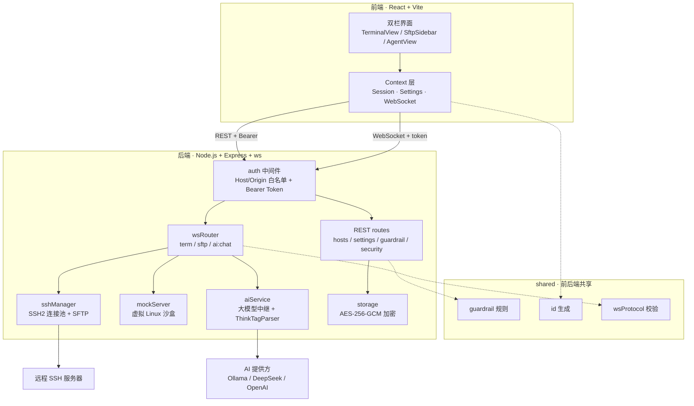

# MonoTerminal

MonoTerminal 是一个集成了 **AI 运维助手** 与 **SFTP 文件管理** 的轻量级 SSH 终端工具。

无需注册登录，没有云端依赖，所有凭据和配置均保存在本地并加密。无论是连真实服务器排查问题，还是借助 AI 快速生成与执行排障命令，开箱即可使用。

👉 **[在线体验 Demo (GitHub Pages)](https://sheilacraig.github.io/MonoTerminal/)**

---

## 💡 为什么做这个项目？

平时在终端排查服务器问题时，通常的流程是：
1. 看到一长串报错，复制出来切到网页问大模型；
2. 大模型给出建议命令后，再手动复制切回终端粘贴执行；
3. 如果需要修改远程服务器的配置文件，还要打开 vim 或另外打开 SFTP 软件。

MonoTerminal 将这三件事整合到了同一个界面中：
- **终端报错时**：按快捷键一键把报错信息发给 AI 诊断；
- **AI 给出命令后**：按回车即可直接在终端里执行，或者按 Tab 键填入终端编辑；
- **需要修改文件时**：左侧自带 SFTP 文件树与在线编辑器，改完 `Ctrl + S` 直接保存同步回服务器。

---

## ✨ 主要功能

- **无需登录，本地优先**：没有账号系统、手机号或云端同步。服务器密码、私钥和 API Key 均在本地通过 AES-256-GCM 加密存储。
- **双栏界面设计**：
  - **左栏**：远程 SFTP 文件管理器，支持拖拽调整宽度、在线查看/编辑文件、修改文件权限（chmod）以及上传下载。按 `Ctrl + B` 可以快速收起。
  - **主视窗**：基于 xterm.js 的全功能终端。按 `Ctrl + \` 可以在终端与 AI 对话界面之间无缝切换，后台会话不会中断。
- **终端与 AI 协同**：
  - 终端出现异常报错时，右下角会自动弹出提示；
  - 呼出 AI 时会自动提取终端最近的输出日志作为提问背景；
  - AI 给出的命令卡片支持 **回车直接运行**、**Tab 填入编辑** 或 **查看命令解释**。
- **多种模型灵活接入**：
  - 支持 **Ollama 本地大模型** 直连（全离线环境可用）；
  - 支持填入自己的 API Key（DeepSeek、OpenAI、Claude、通义千问等）；
  - 未配置模型时，自带本地离线规则引擎提供基础诊断建议。
- **高危命令安全防护**：
  - 内置危险命令检测，对 `rm -rf /`、`mkfs`、误写磁盘（`dd`）等破坏性指令进行拦截；
  - 拦截后需手动输入确认或按 `Alt + Y` 方可继续执行，降低手滑风险。
- **自带免服务器沙盒**：
  - 初次使用无需先配好外部服务器，项目内置了一套虚拟 Linux 环境（模拟了 Nginx 配置、服务报错和系统日志），可以直接体验完整的终端交互与 AI 诊断流程。

---

## ⌨️ 常用快捷键

| 快捷键 | 作用场景 | 说明 |
| :--- | :--- | :--- |
| **`Ctrl + \`** | 终端 / AI 界面 | 在终端与 AI 助手之间来回切换（切到 AI 时自动抓取最近日志） |
| **`Ctrl + B`** | 全局 | 展开 / 收起左侧 SFTP 侧边栏 |
| **`Ctrl + T`** | 全局 | 新建标签页 / 打开主机连接列表 |
| **`Ctrl + W`** | 全局 | 关闭当前会话标签 |
| **`Enter`** | 选中的 AI 命令卡片 | 直接在终端中执行该命令并自动切回终端 |
| **`Tab`** | 选中的 AI 命令卡片 | 将命令填入终端输入行等待修改，不直接回车 |
| **`Ctrl + S`** | SFTP 在线代码编辑器 | 保存当前文件并写回远程服务器 |
| **`Alt + Y`** | 高危命令拦截弹窗 | 确认放行并执行危险命令 |

---

## 🚀 快速上手

### 环境要求
- **Node.js 20 及以上**（推荐 22 LTS，`node -v` 查看版本）
- Windows / macOS / Linux 均可，命令统一在**项目根目录**执行

### 1. 安装依赖
```bash
git clone https://github.com/sheilacraig/MonoTerminal.git
cd MonoTerminal
npm install
```

> [!TIP]
> 仓库自带 `.npmrc`，已把 Electron 等二进制下载指向国内镜像。若 `npm install` 仍然卡住或报 `ECONNRESET / ETIMEDOUT`，多为网络问题，可换用镜像源重试：
> `npm install --registry=https://registry.npmmirror.com`
>
> 只想在浏览器里用（不需要桌面客户端）时，可以跳过上百 MB 的 Electron 二进制下载：
> - Windows CMD：`set ELECTRON_SKIP_BINARY_DOWNLOAD=1 && npm install`
> - PowerShell：`$env:ELECTRON_SKIP_BINARY_DOWNLOAD="1"; npm install`
> - macOS / Linux：`ELECTRON_SKIP_BINARY_DOWNLOAD=1 npm install`

### 2. 运行项目

**方式 A：一条命令启动（推荐，自动构建 + 启动服务）**
```bash
npm run serve
```
启动后在浏览器打开 `http://localhost:3001` 即可使用（端口被占用时会自动顺延，终端里会提示实际端口）。

**方式 B：分步执行（需要自己控制构建时机）**
```bash
npm run build   # 构建前端
npm start       # 启动服务（读取已构建产物）
```

**方式 C：开发模式（支持前端热更新）**
```bash
# 终端 1：启动后端服务 (端口 3001)
npm run server

# 终端 2：启动前端开发服务器 (端口 5173，已配置接口代理)
npm run dev
```
打开 `http://localhost:5173` 进行开发调试。

### 3. 桌面客户端（Windows）
- **直接使用**：下载 [Releases](https://github.com/sheilacraig/MonoTerminal/releases) 里的 `MonoTerminal-Setup-x.y.z.exe`（安装版）或 `MonoTerminal-x.y.z.exe`（免安装单文件），双击即可。
- **自行打包**：见 [桌面端打包指南 (docs/PACKAGING.md)](docs/PACKAGING.md)。

### 4. 遇到问题先自检
```bash
npm run doctor
```
会逐项检查 Node 版本、依赖、原生终端组件、构建产物、端口与数据目录，并给出可直接照做的修复建议。

### 5. 运行测试
```bash
npm test
```

---

## 🆘 常见报错速查

| 现象 | 原因 | 处理办法 |
| :--- | :--- | :--- |
| `因为在此系统上禁止运行脚本` | Windows PowerShell 默认执行策略为 Restricted | 改用 **CMD** 执行 npm 命令，或执行 `Set-ExecutionPolicy -Scope CurrentUser -ExecutionPolicy RemoteSigned` |
| `npm install` 报 `ECONNRESET / ETIMEDOUT / RequestError` | 从 GitHub 拉取 Electron 二进制被网络阻断 | 项目自带 `.npmrc` 已指向国内镜像；仍失败时加 `--registry=https://registry.npmmirror.com`，或设置 `ELECTRON_SKIP_BINARY_DOWNLOAD=1` 跳过桌面端依赖 |
| 启动后浏览器提示 `Cannot GET /` | 只启动了服务、没有构建前端 | 执行 `npm run build`，或直接用 `npm run serve` |
| 端口 3001 被占用 | 其他程序占用了默认端口 | 后端会自动改用后续空闲端口（以终端输出为准）；也可显式指定：`PORT=4000 npm start` |
| 桌面端提示「后台服务启动超时」 | 安全软件拦截、端口被长期占用、或残留进程 | 把 MonoTerminal 加入杀软信任；关闭占用 3001 的程序；日志见 `%APPDATA%\monoterminal\logs\main.log` |
| 打包报 `EBUSY: resource busy or locked ... default_app.asar` | 上次打包被中断，或调试时运行过 `release\win-unpacked` 里的 exe，残留文件被锁定 | 打包脚本已内置清理；若仍失败，关闭正在运行的 MonoTerminal/杀软信任/暂停网盘同步后重试，或直接重启电脑 |
| 从 VS Code 等编辑器的集成终端启动 exe 没反应/报 `bad option` | 这类宿主会在环境里注入 `ELECTRON_RUN_AS_NODE=1`，Electron 会被当成 Node 执行 | **双击图标启动**即可；或在启动前清除该环境变量（PowerShell：`Remove-Item Env:\ELECTRON_RUN_AS_NODE`） |

---

## 📁 项目结构

```
MonoTerminal/
├── src/                  # 前端界面 (React + Tailwind CSS + xterm.js)
│   ├── components/       # 界面组件 (终端、AI 对话窗、SFTP 侧边栏、弹窗等)
│   ├── context/          # 全局状态 (会话管理、设置、WebSocket 通信)
│   └── utils/            # 报错检测与命令安全匹配工具
├── shared/               # 前后端共享代码 (高危命令规则、ID 生成)
├── server/               # 后端服务 (Node.js + Express + WebSocket)
│   ├── sshManager.ts     # SSH2 连接池与 SFTP 管理
│   ├── mockServer.ts     # 内置虚拟 Linux 沙盒
│   ├── aiService.ts      # 大模型中继接口 (Ollama / DeepSeek / OpenAI 等)
│   ├── storage.ts        # 本地 AES-256-GCM 加密存储
│   ├── guardrail.ts      # 高危命令拦截规则
│   └── routes/           # REST API 路由
├── electron/             # Electron 桌面客户端外壳
├── scripts/              # 维护脚本 (环境自检 doctor / 打包前清理 / 打包产物验证)
├── docs/                 # 项目文档 (打包指南等)
└── tests/                # 单元测试与集成测试
```

---

## 🏗️ 架构概览

前端通过 REST（配置/主机管理）与 WebSocket（终端流、SFTP、AI 对话）两条通道与本地后端通信；所有请求先经过 `auth` 中间件的 Host/Origin 白名单与 Bearer Token 校验。高危命令规则、ID 生成与消息协议位于 `shared/`，前后端共用同一份定义，避免规则漂移。



---

## 🤝 贡献指南

欢迎提交 Issue 与 Pull Request！开发环境搭建、分支/提交规范、代码检查与测试要求详见：  
👉 [贡献指南 (CONTRIBUTING.md)](CONTRIBUTING.md)

---

## 📄 开源协议

本项目采用 [MIT License](LICENSE) 开源。
