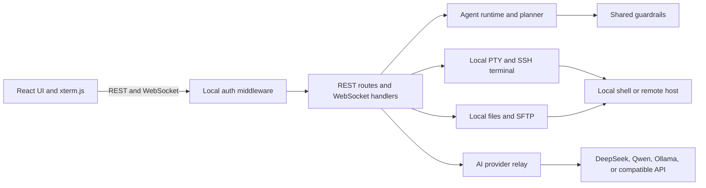

# MonoTerminal

**(English | [中文](README.zh.md))**

MonoTerminal is a lightweight terminal that brings an **AI operations assistant**, **SSH/SFTP**, and **local file management** into one workspace.

No account is required and there is no cloud dependency. Credentials and settings are stored locally and encrypted with AES-256-GCM. Use it with your local shell, connect to a remote server, or ask an AI model to help investigate an issue.

👉 **[Download the Windows desktop app](https://github.com/sheilacraig/MonoTerminal/releases)**

## Why MonoTerminal?

A typical server troubleshooting loop means copying an error into a browser, copying a suggested command back to a terminal, and opening another app to edit a remote file. MonoTerminal brings those steps together:

- Send terminal errors and recent command context to the AI assistant.
- Run suggested commands in the terminal or insert them for editing first.
- Browse and edit local or remote files in the built-in file panel.
- Create execution plans with step-by-step progress, verification, and approval for sensitive actions.

## Features

- **Local-first, no sign-in:** Host credentials, private keys, and API keys are encrypted locally with AES-256-GCM. An optional master password adds PBKDF2-SHA512 protection.
- **Local terminal:** Starts a local shell without requiring a remote server. Uses `node-pty` for interactive terminal behavior, ANSI color, and shell completion.
- **Session and file dock:** The left dock switches between grouped host sessions and local/remote files. Search hosts, open connections in the current or a new tab, and edit files in place.
- **Terminal and AI side by side:** Keep the assistant beside the terminal, resize the panes, and use `Ctrl + \\` to show or hide it. Session connections stay active in the background.
- **Shell integration:** OSC 133/OSC 7 integration tracks command lifecycle, exit codes, and working-directory updates when the shell emits those sequences. Terminal output is sanitized to prevent command output from spoofing integration events.
- **AI chat and autonomous plans:** Use quick Q&A or Plan-Execute-Verify. Review plans, monitor step output, approve sensitive actions, resume failed plans, and inspect a unified command/file/agent timeline.
- **Multiple AI providers:** Configure DeepSeek, Qwen, Ollama, or any OpenAI-compatible endpoint. If no model is configured, a local offline diagnostic fallback provides basic suggestions.
- **Safety controls:** Risk analysis blocks catastrophic commands and asks for confirmation for sensitive operations. Sudo prompts use a dedicated masked input panel.
- **Clipboard and terminal ergonomics:** Optional copy-on-select, right-click paste, and adjustable assistant input height.

## Keyboard shortcuts and gestures

| Shortcut / gesture | Action |
| :--- | :--- |
| **`Ctrl + \\`** | Show or hide the AI assistant |
| **`Ctrl + B`** | Expand or collapse the host/file dock |
| **`Ctrl + T`** | Open a new session tab or show the session list |
| **`Ctrl + W`** | Close the current session |
| **`Enter`** on an AI command card | Run the command in the terminal |
| **`Tab`** on an AI command card | Insert the command into the terminal for editing |
| **`Ctrl + S`** | Save the open file to the local or remote host |
| **`Alt + P`** | Open the sensitive-input / sudo password panel |
| **`Alt + Y`** | Confirm a command in the danger prompt |
| **Double-click a host** | Connect in the current tab |
| **Middle-click / `Ctrl` + double-click a host** | Open the host in a new tab |
| **Select terminal text** | Copy selected text when copy-on-select is enabled |
| **Right-click in the terminal** | Paste clipboard contents at the terminal cursor |

## Quick start

### Requirements

- Node.js 20 or later (Node.js 22 LTS recommended)
- Windows, macOS, or Linux

Run the following commands from the repository root.

### Install dependencies

```bash
git clone https://github.com/sheilacraig/MonoTerminal.git
cd MonoTerminal
npm install
```

The repository includes an `.npmrc` configured for a package mirror. If installation fails with `ECONNRESET` or `ETIMEDOUT`, retry with another registry:

```bash
npm install --registry=https://registry.npmmirror.com
```

To run the browser version without downloading Electron binaries:

```bash
# Windows CMD
set ELECTRON_SKIP_BINARY_DOWNLOAD=1 && npm install

# PowerShell
$env:ELECTRON_SKIP_BINARY_DOWNLOAD="1"; npm install

# macOS / Linux
ELECTRON_SKIP_BINARY_DOWNLOAD=1 npm install
```

### Run the application

Recommended: build the frontend and backend, then start the local service:

```bash
npm run serve
```

Open `http://localhost:3001` in a browser. If the port is busy, the server selects the next available port and prints it in the terminal.

For a split build and start:

```bash
npm run build:all
npm start
```

For development with hot reload, run these in separate terminals:

```bash
# Terminal 1: backend on port 3001
npm run server

# Terminal 2: frontend on port 5173
npm run dev
```

Then open `http://localhost:5173`.

> `npm run build` builds only the frontend. Use `npm run build:server` for the backend or `npm run build:all` for both.

### Windows desktop app

Download `MonoTerminal-Setup-x.y.z.exe` (installer) or `MonoTerminal-x.y.z.exe` (portable) from [GitHub Releases](https://github.com/sheilacraig/MonoTerminal/releases). To build it yourself, see the [packaging guide](docs/PACKAGING.md).

### Diagnostics and tests

```bash
npm run doctor
npm run verify:source
npm test
```

`doctor` checks the runtime and native terminal components. `verify:source` checks the source setup, ports, REST authentication, origin allowlist, and WebSocket protocol. The Vitest suite covers guardrails, shell integration, agent planning, terminal authentication, encrypted storage, and related behavior.

## Troubleshooting

| Symptom | Likely cause | Suggested fix |
| :--- | :--- | :--- |
| PowerShell says scripts are disabled | Execution policy is `Restricted` | Run npm commands in CMD, or set the current-user policy to `RemoteSigned`. |
| `npm install` fails with `ECONNRESET` / `ETIMEDOUT` | Network access to the Electron binary host is blocked | Retry with `--registry=https://registry.npmmirror.com` or set `ELECTRON_SKIP_BINARY_DOWNLOAD=1` for browser-only use. |
| `Cannot find module ... dist-server/index.cjs` | Only the frontend was built | Run `npm run build:all`, `npm run build:server`, or `npm run serve`. |
| Browser shows `Cannot GET /` | The frontend assets have not been built | Run `npm run build` or `npm run serve`. |
| Port 3001 is occupied | Another process uses the default port | The server selects another available port. You can also set `PORT=4000` before starting it. |
| Desktop app reports a backend startup timeout | Security software, a port conflict, or a stale process | Allow MonoTerminal in security software and close processes using the port. Logs are under `%APPDATA%\\monoterminal\\logs\\main.log`. |
| Starting the app from an editor terminal fails with `bad option` | The environment sets `ELECTRON_RUN_AS_NODE=1` | Launch from the app icon or remove that environment variable before starting Electron. |

## Project structure

```text
MonoTerminal/
├── src/                 # React + Tailwind UI and xterm.js terminal
├── shared/              # Shared guardrails, IDs, and WebSocket protocol
├── server/              # Express, WebSocket, SSH/SFTP, and agent runtime
│   ├── agent/            # Planner, runtime, verifiers, tools, model adapters
│   ├── application/      # Session, command, context, and security services
│   ├── domain/           # Domain models and provider contracts
│   ├── infrastructure/  # Local, SSH, and mock providers
│   └── ws/               # WebSocket routing and handlers
├── electron/            # Electron desktop shell
├── scripts/             # Diagnostics and packaging verification
├── docs/                # Project documentation
└── tests/               # Unit and integration tests
```

## Architecture

The frontend communicates with the local backend through REST (settings and host management) and WebSocket (terminal streams, file operations, AI chat, and agent events). Requests are protected by host/origin checks and a bearer token. Shared guardrail rules and WebSocket schemas live in `shared/` so the client and server use the same definitions.



## Contributing

Issues and pull requests are welcome. See [CONTRIBUTING.md](CONTRIBUTING.md) for development setup, branch and commit conventions, and code checks.

## License

MonoTerminal is released under the [MIT License](LICENSE).
