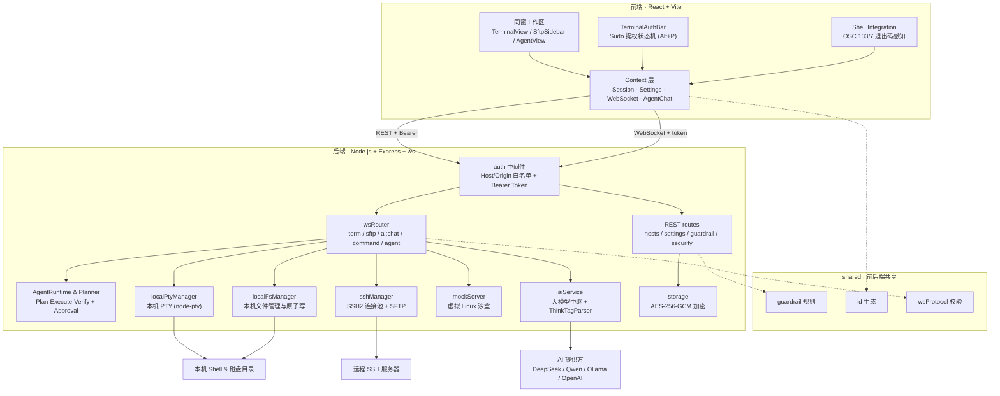

# MonoTerminal

**([English](README.md) | 中文)**

MonoTerminal 是一个集成了 **AI 运维助手** 与 **SFTP / 本地文件管理** 的轻量级终端工具。

无需注册登录，没有云端依赖，所有凭据和配置均保存在本地并通过 AES-256-GCM 加密存储。无论是直接打开**本机终端 (Local Shell)**日常操作，还是连接远程服务器排查问题，亦或借助 AI 快速生成与执行排障命令，开箱即可使用。

👉 **[直接下载 Windows 桌面版 (GitHub Releases)](https://github.com/sheilacraig/MonoTerminal/releases)**

---

## 💡 为什么做这个项目？

平时在终端排查服务器问题时，通常的流程是：
1. 看到一长串报错，复制出来切到网页问大模型；
2. 大模型给出建议命令后，再手动复制切回终端粘贴执行；
3. 如果需要修改远程服务器的配置文件，还要打开 vim 或另外打开 SFTP 软件。

MonoTerminal 将这三件事整合到了同一个界面中：
- **终端报错时**：按快捷键一键把报错信息发给 AI 诊断；
- **AI 给出命令后**：按回车即可直接在终端里执行，或者按 Tab 键填入终端编辑；
- **需要修改文件时**：左侧自带 SFTP / 本地文件树与在线编辑器，改完 `Ctrl + S` 直接保存同步回服务器或写回本地磁盘。

---

## ✨ 主要功能

- **无需登录，本地优先**：没有账号系统、手机号或云端同步。服务器密码、私钥和 API Key 均在本地通过机器派生密钥的 AES-256-GCM 硬件级加密存储。
- **开箱即用本机终端 (Local Shell)**：
  - 启动后默认进入本机终端，无需预先准备云服务器；
  - 基于 `node-pty` 原生伪终端，Windows 下自动探测匹配 PowerShell 7 / PowerShell 5 / CMD，macOS/Linux 自动匹配 Bash / Zsh；
  - 完整支持 ANSI 真彩与 Tab 补全，左侧文件树自动联动本机用户目录。
- **同窗双栏与「会话 / 文件」一体化 Dock**：
  - **左栏（「会话 / 文件」双 Tab 共用 Dock）**：默认收起为精简侧边条以最大化终端视野，可点击展开按钮或按 `Ctrl + B` 随时唤出；支持拖拽调整宽度。
    - **「会话」Tab**：按环境分组管理主机资产与本机终端，支持关键字搜索过滤、双击在当前标签连接、中键/Ctrl+双击在新标签打开、跨分组拖拽移动、右键菜单（复制会话、跨平台复制连接命令、属性编辑等），并在底部提供醒目的「新建会话 / 属性 / AI 与系统设置」快捷栏。
    - **「文件」Tab**：远程 SFTP / 本地文件管理器，支持在线查看/编辑文件（`Ctrl + S` 直接保存写回）、修改文件权限（chmod）以及上传下载。
  - **主视窗**：极简顶部多会话标签栏 + 基于 xterm.js 的全功能终端与 **MonoTerminal Ops Agent** 同窗并列协作。按 `Ctrl + \` 可在同一窗口随时展开或收起 AI 助手，支持自由拖拽调节终端与助手分栏宽度及提问输入框高度，后台会话长连接不会中断。
- **语义感知 Shell Integration (OSC 133 / OSC 7) 与通道防污染**：
  - 深度支持现代终端语义协议，实时监听命令执行生命周期、当前工作目录（CWD）与退出码；
  - **100% 基于真实 Exit Code != 0 判定报错**，彻底告别传统正则表达式匹配带来的误报与漏报；
  - **广播输出净化与无钩子自动降级**：对 Agent 广播进终端的命令输出自动剥离恶意/嵌套 OSC 133/7 与 DCS 控制序列，防止语义通道被污染；针对受执行策略或自定义 `$PROFILE` 影响而缺失 OSC 133 钩子的 PowerShell 会话，支持毫秒级快速探测并自动降级为后台隔离执行模式。
- **终端与 AI 协同 & 自主运维 Agent**：
  - 终端出现异常报错时自动感知，呼出 AI 时自动带入失败命令、退出码与最近终端输出；
  - AI 给出的命令卡片支持 **一键运行**、**填入终端** 或 **查看命令解析**；
  - 支持 **⚡ 快速问答** 与 **🧭 计划执行 (Plan-Execute-Verify)** 双模式：计划执行全程在对话历史中留下完整步骤轨迹卡片，并在执行结束后由大模型自动汇总输出最终执行情况报告；配合 **高危工具调用人工审批 (Human-in-the-Loop)** 与 **会话统一时间线 (Command / File / Agent)**，形成可观测、可中止、可验证的排障闭环。
- **Sudo 提权安全防护与密码浮层**：
  - 终端执行提权命令（如 `sudo`）时自动呼出专属密码输入浮层，也可按 `Alt + P` 手动随时呼出；
  - 针对多行脚本和 heredoc 块，内置前置 `sudo -v` 探测验证，杜绝密码在终端明文回显或被后续脚本管道消费，消除 PAM 时延竞态风险。
- **无感顺滑的剪贴板体验**：
  - 终端鼠标划选文字**自动复制**至剪贴板（基于 mouseup 优化，拖选无卡顿）；
  - 终端与 AI 面板均支持**鼠标右键一键粘贴**；原生 `Ctrl + V` 零权限直通；
  - AI 诊断面板文字全域支持自由选中复制。
- **多种模型灵活接入 (BYOK)**：
  - 内置 **DeepSeek 官方 API**、**Qwen (通义千问) 官方 API**、**Ollama 本地直连** 与 **OpenAI 兼容接口** 配置端点，支持自定义添加任意兼容端点；
  - API Key 在本地经 AES-256-GCM 加密存储（可选开启 PBKDF2-SHA512 主密码保护）；
  - 未配置 API Key 时，自动回退至本地离线诊断规则引擎提供基础排障建议。
- **高危命令安全防护**：
  - 内置危险命令检测，对 `rm -rf /`、`mkfs`、误写磁盘（`dd`）等破坏性指令进行拦截；
  - 拦截后需手动输入确认或按 `Alt + Y` 方可继续执行，降低手滑风险。

---

## ⌨️ 常用快捷键与手势

| 快捷键 / 手势 | 作用场景 | 说明 |
| :--- | :--- | :--- |
| **`Ctrl + \`** | 终端 / AI 界面 | 展开 / 收起右侧 AI 运维助手（切到 AI 时自动抓取最近上下文） |
| **`Ctrl + B`** | 全局 | 展开 / 收起左侧「会话 / 文件」一体化侧边 Dock |
| **`Ctrl + T`** | 全局 | 新建标签页 / 展开左侧「会话」列表 |
| **`Ctrl + W`** | 全局 | 关闭当前会话标签并断开连接 |
| **`Enter`** | 选中的 AI 命令卡片 | 直接在终端中执行该命令并自动切回终端 |
| **`Tab`** | 选中的 AI 命令卡片 | 将命令填入终端输入行等待修改，不直接回车 |
| **`Ctrl + S`** | 在线代码编辑器 | 保存当前文件并写回远程服务器或本地磁盘 |
| **`Alt + P`** | 终端界面 | 手动唤起敏感输入 / Sudo 密码输入浮层 |
| **`Alt + Y`** | 高危命令拦截弹窗 | 确认放行并执行危险命令 |
| **双击主机项** | 左侧「会话」列表 | 在当前活动标签中直接连接该主机 |
| **中键 / `Ctrl+双击`** | 左侧「会话」列表 | 在新标签页中打开并连接该主机 |
| **鼠标划选** | 终端界面 | 划选文字自动复制至系统剪贴板（可在设置中开启/关闭） |
| **鼠标右键** | 终端界面 | 将系统剪贴板内容直接粘贴至终端光标处 |

---

## 🚀 快速上手

### 环境要求
- **Node.js 20 及以上**（推荐 22 LTS，`node -v` 查看版本）
- Windows / macOS / Linux 均可，命令统一在**项目根目录**执行

### 1. 安装依赖
```bash
git clone https://github.com/sheilacraig/MonoTerminal.git
cd MonoTerminal
npm install
```

> [!TIP]
> 仓库自带 `.npmrc`，已把 Electron 等二进制下载指向国内镜像。若 `npm install` 仍然卡住或报 `ECONNRESET / ETIMEDOUT`，多为网络问题，可换用镜像源重试：
> `npm install --registry=https://registry.npmmirror.com`
>
> 只想在浏览器里用（不需要桌面客户端）时，可以跳过上百 MB 的 Electron 二进制下载：
> - Windows CMD：`set ELECTRON_SKIP_BINARY_DOWNLOAD=1 && npm install`
> - PowerShell：`$env:ELECTRON_SKIP_BINARY_DOWNLOAD="1"; npm install`
> - macOS / Linux：`ELECTRON_SKIP_BINARY_DOWNLOAD=1 npm install`

### 2. 运行项目

**方式 A：一条命令启动（推荐，自动构建前端与后端并启动服务）**
```bash
npm run serve
```
启动后在浏览器打开 `http://localhost:3001` 即可使用（端口被占用时会自动顺延，终端里会提示实际端口）。

**方式 B：分步执行（需要自己控制构建时机）**
```bash
npm run build:all   # 同时构建前端 (dist/) 与后端服务 (dist-server/)
npm start           # 启动后端服务（读取已构建产物）
```
> [!NOTE]
> `npm run build` 仅编译前端代码；若需单独编译后端服务，请执行 `npm run build:server`。若只执行 `npm run build && npm start` 会因缺失后端产物报错。

**方式 C：开发模式（支持前端热更新）**
```bash
# 终端 1：启动后端开发服务 (端口 3001)
npm run server

# 终端 2：启动前端开发服务器 (端口 5173，已配置接口代理)
npm run dev
```
打开 `http://localhost:5173` 进行开发调试。

### 3. 桌面客户端（Windows）
- **直接使用**：前往 [Releases 页面](https://github.com/sheilacraig/MonoTerminal/releases) 下载 `MonoTerminal-Setup-x.y.z.exe`（安装版）或 `MonoTerminal-x.y.z.exe`（免安装便携版），双击即可运行。
- **自行打包**：详见 [桌面端打包指南 (docs/PACKAGING.md)](docs/PACKAGING.md)。

### 4. 遇到问题先自检
```bash
# 环境与组件诊断
npm run doctor

# 源码全链路自检（含端口探测、REST鉴权、Origin白名单与WS协议验证）
npm run verify:source
```
会逐项检查 Node 版本、依赖、原生终端组件、前后端产物、端口可用性与数据目录，给出精准修复建议。

### 5. 运行测试
```bash
npm test
```
内置 **182 项（19 个测试套件）** 覆盖率完备的自动化单元与集成测试（涵盖 Guardrail 规则、Shell Integration 语义感知与防污染净化、PowerShell 无钩子自动降级、Agent 自主规划与验证、TerminalAuth 提权状态机、AES 加密存储等核心逻辑）。

---

## 🆘 常见报错速查

| 现象 | 原因 | 处理办法 |
| :--- | :--- | :--- |
| `因为在此系统上禁止运行脚本` | Windows PowerShell 默认执行策略为 Restricted | 改用 **CMD** 执行 npm 命令，或在 PowerShell 执行 `Set-ExecutionPolicy -Scope CurrentUser -ExecutionPolicy RemoteSigned` |
| `npm install` 报 `ECONNRESET / ETIMEDOUT / RequestError` | 从 GitHub 拉取 Electron 二进制被网络阻断 | 项目自带 `.npmrc` 已指向国内镜像；仍失败时加 `--registry=https://registry.npmmirror.com`，或设置 `ELECTRON_SKIP_BINARY_DOWNLOAD=1` 跳过桌面端依赖 |
| `Cannot find module ... dist-server/index.cjs` | 分步执行时仅跑了 `npm run build`，遗漏了后端编译 | 执行 `npm run build:all`（或 `npm run build:server`），或直接使用 `npm run serve` |
| 启动后浏览器提示 `Cannot GET /` | 只启动了后端服务、没有构建前端静态产物 | 执行 `npm run build` 或直接执行 `npm run serve` |
| 端口 3001 被占用 | 其他程序占用了默认端口 | 后端会自动改用后续空闲端口（以终端输出为准）；也可显式指定：`PORT=4000 npm start` |
| 桌面端提示「后台服务启动超时」 | 安全软件拦截、端口被长期占用、或残留进程 | 把 MonoTerminal 加入杀软信任；关闭占用 3001 的程序；日志见 `%APPDATA%\monoterminal\logs\main.log` |
| 打包报 `EBUSY: resource busy or locked ... default_app.asar` | 上次打包被中断，或调试时运行过 `release\win-unpacked` 里的 exe，残留文件被锁定 | 打包脚本已内置清理；若仍失败，关闭正在运行的 MonoTerminal/杀软信任/暂停网盘同步后重试，或直接重启电脑 |
| 从 VS Code 等编辑器的集成终端启动 exe 没反应/报 `bad option` | 这类宿主会在环境里注入 `ELECTRON_RUN_AS_NODE=1`，Electron 会被当成 Node 执行 | **双击图标启动**即可；或在启动前清除该环境变量（PowerShell：`Remove-Item Env:\ELECTRON_RUN_AS_NODE`） |

---

## 📁 项目结构

```
MonoTerminal/
├── src/                      # 前端界面 (React + Tailwind CSS + xterm.js)
│   ├── components/           # 界面组件 (终端视图、MonoTerminal Ops Agent、「会话/文件」双 Tab Dock、提权浮层等)
│   ├── context/              # 全局状态 (会话管理、系统设置、WebSocket 通信、Agent 会话状态)
│   ├── services/             # 业务服务 (terminalAuth 提权状态机与敏感凭据管控)
│   └── utils/                # 工具函数 (OSC 133/7 语义感知、跨平台连接命令格式化、剪贴板作用域、命令清洗)
├── shared/                   # 前后端共享代码 (高危命令规则、ID 生成、WebSocket 协议定义)
├── server/                   # 后端服务 (Node.js + Express + WebSocket)
│   ├── agent/                # Agent 运行时 (Planner、AgentRuntime、Verifier、Shell/File/Git/Ssh 工具与模型适配)
│   ├── application/          # 应用编排层 (SessionManager、CommandEngine、ContextEngine、GuardrailPipeline、ApprovalManager)
│   ├── domain/               # 领域模型与接口契约 (Session、TerminalProvider、FileSystemProvider)
│   ├── infrastructure/       # 基础设施实现 (Local / SSH / Mock 终端与文件系统 Provider)
│   ├── localPtyManager.ts    # 本机伪终端管理器 (基于 node-pty)
│   ├── localFsManager.ts     # 本机文件系统管理器 (Local FS 读写与原子保存)
│   ├── sshManager.ts         # SSH2 连接池与 SFTP 管理
│   ├── mockServer.ts         # 内置虚拟 Linux 测试环境
│   ├── aiService.ts          # 大模型中继接口 (DeepSeek / Qwen / Ollama / OpenAI 等)
│   ├── storage.ts            # 本地 AES-256-GCM 加密存储与主密码保护
│   ├── guardrail.ts          # 高危命令拦截规则定义
│   ├── auth.ts               # HTTP / WebSocket 安全与鉴权中间件
│   ├── ws/                   # WebSocket 消息路由与分发处理 (term, sftp, ai, command, agent)
│   └── routes/               # REST API 路由 (hosts, settings, guardrail, security)
├── electron/                 # Electron 桌面客户端外壳
├── scripts/                  # 维护脚本 (环境诊断 doctor / 源码链路验证 / 打包产物校验)
├── docs/                     # 项目文档 (桌面端打包指南等)
└── tests/                    # 单元测试与集成测试 (19 个套件 / 182 项用例)
```

---

## 🏗️ 架构概览

前端通过 REST（配置/主机管理）与 WebSocket（终端流、SFTP/本地文件、AI 对话与自主 Agent 事件）两条通道与本地后端通信；所有请求先经过 `auth` 中间件的 Host/Origin 白名单与 Bearer Token 校验。高危命令规则、ID 生成与消息协议位于 `shared/`，前后端共用同一份定义，避免规则漂移。



---

## 🤝 贡献指南

欢迎提交 Issue 与 Pull Request！开发环境搭建、分支/提交规范、代码检查与测试要求详见：
👉 [贡献指南 (CONTRIBUTING.md)](CONTRIBUTING.md)

---

## 📄 开源协议

本项目采用 [MIT License](LICENSE) 开源。
